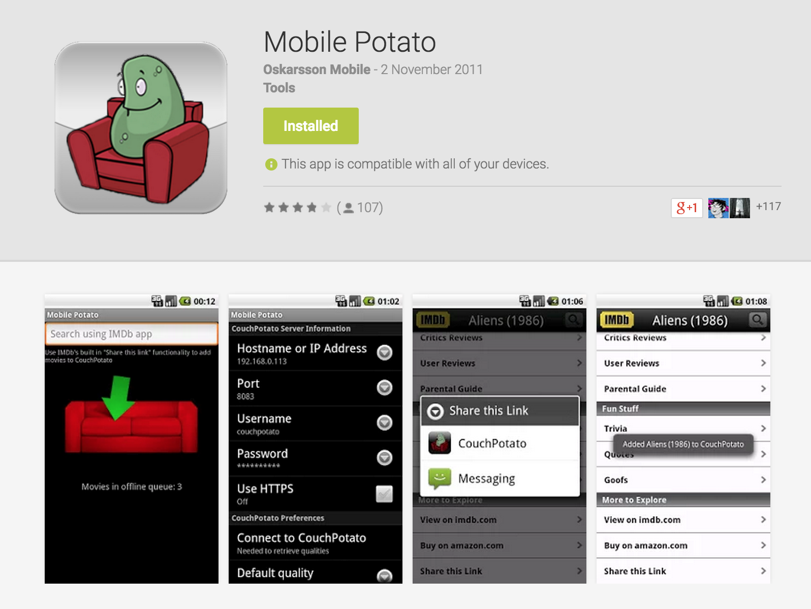

# Discontinued (!)
This project was discontinued in 2011 when CouchPotato changed their API and because I moved to an iPhone. It was removed from the Google Play store because of user complaints, who migrated to CP v2+. Total number of unique user installs: 13,528.

# Mobile-Potato
Mobile Potato is an Android companion app for CouchPotato with which you can add movies to CouchPotato. The main feature is the integration with the IMDb app, which allows you to directly add movies to CP from the IMDb app.

